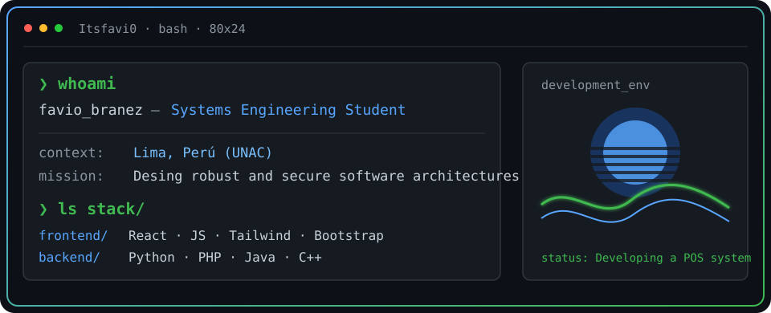

<!-- LOCAL TECH BANNER -->
<a href="https://github.com/Itsfavi0">
  <picture>
    <source media="(prefers-color-scheme: dark)" srcset="assets/banner-dark.v9.svg">
    <source media="(prefers-color-scheme: light)" srcset="assets/banner-light.v9.svg">
    
  </picture>
</a>

 

---

## `$ whoami`

  

 

## `$ cat tech-stack.yaml`

<table border="1" cellpadding="14" bgcolor="#0D1117">
  <thead>
    <tr>
      <th colspan="2" align="left"><code>Itsfavi0:~$ cat tech-stack.yaml</code></th>
    </tr>
  </thead>
  <tbody>
    <tr>
      <td width="50%" valign="top"><code>├─ ✦ frontend_development:</code>  
         
        <code>React · JavaScript · HTML5 · CSS3 · Tailwind · Bootstrap</code>
      </td>
      <td width="50%" valign="top"><code>├─ ⚙ backend_and_desktop:</code>  
         
        <code>Python (Tkinter) · PHP · Java · C++</code>
      </td>
    </tr>
    <tr>
      <td valign="top"><code>├─ ▣ databases:</code>  
        
         
        <code>MySQL · PostgreSQL · SQLite · SQL Server</code>
      </td>
      <td valign="top"><code>├─ 🛠️ tools_and_infrastructure:</code>  
         
        <code>Git · Docker · Linux (CachyOS) · Ubuntu Server · Win 11</code>
      </td>
    </tr>
  </tbody>
  <tfoot>
    <tr>
      <td colspan="2"><code style="color: #3FB950;">status: compiling&nbsp;&nbsp;·&nbsp;&nbsp;environment: development</code></td>
    </tr>
  </tfoot>
</table>

---

## `$ top -o %CPU`

<table align="center" style="border: none; background: transparent;">
  <tr>
    <td align="center" valign="middle" style="border: none; padding: 0 15px;">
      <picture>
        <source media="(prefers-color-scheme: dark)" srcset="assets/radar-dark.svg">
        <source media="(prefers-color-scheme: light)" srcset="assets/radar-light.svg">
        <!-- Se usa height en lugar de width para igualar la escala vertical -->
        
      </picture>
    </td>
    <td align="center" valign="middle" style="border: none; padding: 0 15px;">
      <picture>
        <source media="(prefers-color-scheme: dark)" srcset="assets/radar-langs-dark.svg">
        <source media="(prefers-color-scheme: light)" srcset="assets/radar-langs-light.svg">
        <!-- La misma altura para mantener la alineación del centro -->
        
      </picture>
    </td>
  </tr>
</table>

<code>signals: engineering_skill_radar · language_stack_radar · status: learning</code>

---

<!-- SOCIALS -->
## `$ connect --network`

&nbsp;&nbsp;
&nbsp;&nbsp;

 
 

Diseñando sistemas desde Lima, Perú · @Itsfavi0

